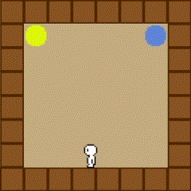
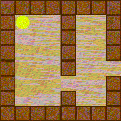
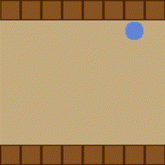
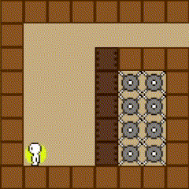
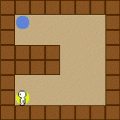

# bq-r

[Download the latest release here :)](https://github.com/sarahkittyy/blockquest-remake/releases/latest)

This is a work-in-progress remake of [BlockQuest](http://www.blockquest.net/).







##### I plan to implement:
- A replication of the original blockquest engine.
- A level editor, where you can build levels
- A full UI
- Authentication
- A backend server to allow users to publish their levels
- Search functionality to browse popular levels, download and play them

All assets in `assets/` are ripped straight from the original BlockQuest SWF available for download on the [blockquest site](http://www.blockquest.net). Daigo don't sue me :p

## Dependencies

- C++20
- OpenSSL

## Building

```bash
$ git clone https://github.com/sarahkittyy/blockquest-remake
$ cd blockquest-remake
$ mkdir build
$ cd build
$ cmake ..
$ make
```

## Running

The `assets/` folder must be in the current directory.

```bash
$ cd blockquest-remake
$ ./build/bq-r
```
